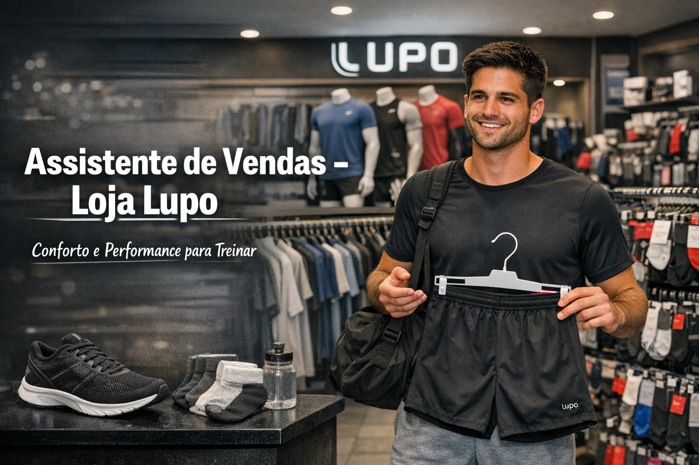
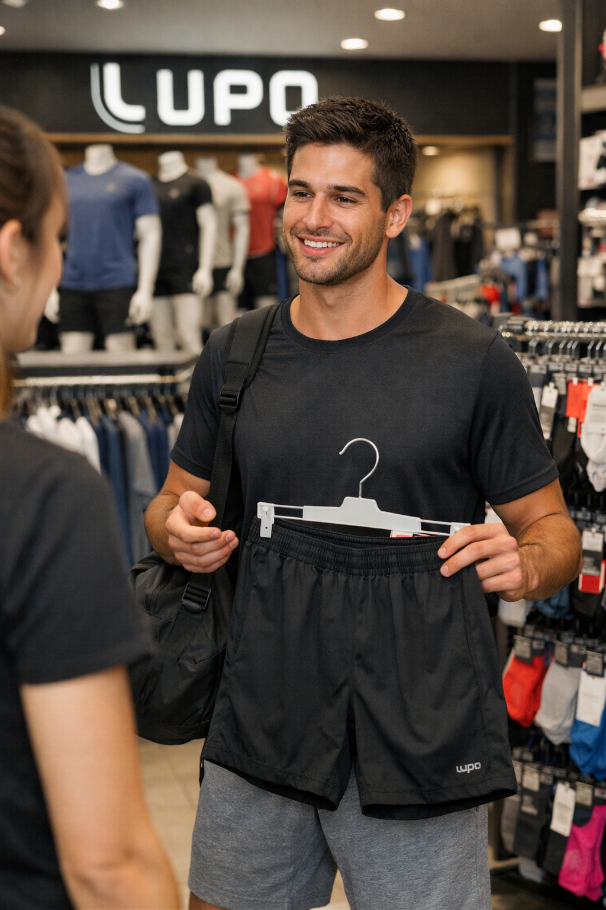
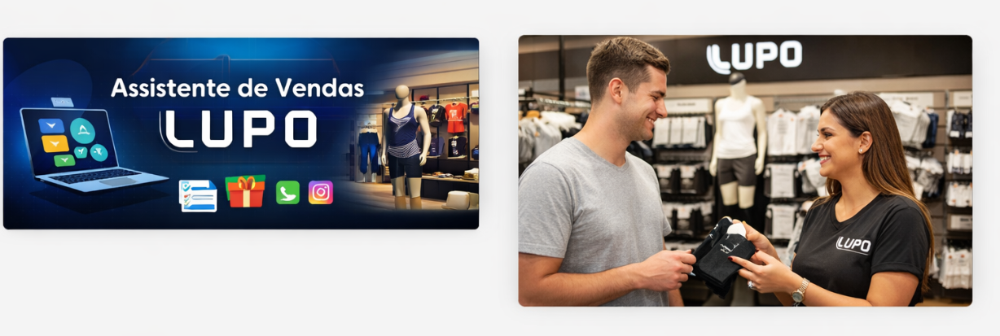

# Assistente-de-Vendas-Loja-Lupo
Projeto Prompt Dio - LUPO

é um framework inteligente para atendimento comercial em lojas de moda, com foco na marca **Lupo**.  
Ele simula um assistente de vendas capaz de:

- Diagnosticar oportunidades com base no interesse do cliente  
- Sugerir ofertas principais e complementares (upsell e cross-sell)  
- Gerar mensagens prontas para WhatsApp e Instagram  
- Aplicar estratégias de ancoragem sem depender de preços exatos  
- Adaptar o atendimento a diferentes perfis e ocasiões (academia, presente, trabalho, conforto diário)

--- 



---
```
## 📂 Estrutura do Projeto

AssistenteDeVendas-Lupo/
├── data/                   # Dados estruturados
│   ├── framework.json       # Lógica central do assistente
│   ├── mensagens.json       # Mensagens prontas para canais
│   └── exemplos.json        # Casos simulados
│
├── scripts/                # Lógica de atendimento e ofertas
│   ├── atendimento.js       # Simulação de atendimento
│   ├── qualificacao.js      # Perguntas de qualificação
│   └── ofertas.js           # Ofertas principais e complementares
│
├── mensagens/              # Textos prontos para canais de venda
│   ├── whatsapp.txt         # Mensagens comerciais para WhatsApp
│   ├── instagram.txt        # Mensagens curtas para Instagram DM
│   └── presente.txt         # Mensagens específicas para presentes
│
├── exemplos/               # Casos práticos documentados
│   ├── academia.md          # Cliente buscando roupas para academia
│   ├── presente.md          # Cliente buscando presente
│   └── trabalho.md          # Cliente buscando roupas para trabalho
│
├── assets/                 # Recursos visuais
│   ├── github-cover.png     # Capa personalizada para GitHub
│   └── loja-lupo.png        # Imagem ilustrativa do cliente na loja
│
└── docs/                   # Documentação detalhada do projeto
    ├── guia-uso.md          # Como usar o assistente de vendas
    ├── fluxo-atendimento.md # Etapas A-F com exemplos
    ├── estrutura-dados.md   # Explicação do framework.json
    ├── aplicacao-comercial.md # Estratégias de venda e gatilhos
    └── manual-vendedor.md   # Orientações práticas para equipe de loja

```

---

📦 Estrutura do Projeto
O assistente segue uma lógica de atendimento dividida em etapas:

Leitura do interesse  
Interpreta o que o cliente deseja e resume em 1–2 linhas.

Diagnóstico de oportunidade  
Classifica o tipo de venda (high ticket, misto ou low ticket) e identifica o que falta para fechar.

Perguntas de qualificação  
Até 5 perguntas objetivas para entender orçamento, estilo, urgência e ocasião.

Oferta principal recomendada  
Sugestão de produto ou kit com justificativa e frase de apresentação.

Oferta complementar (cross-sell)  
Sugestão de 2–4 itens adicionais que façam sentido com o interesse inicial.

Estratégia de ancoragem  
Apresentação de valor em 2 formatos: bom/ótimo/premium ou custo-benefício vs performance.

---



---

## 📖 Documentação

- [Guia de Uso](docs/guia-uso.md) → Como usar o assistente de vendas  
- [Fluxo de Atendimento](docs/fluxo-atendimento.md) → Etapas A-F com exemplos práticos  
- [Estrutura de Dados](docs/estrutura-dados.md) → Explicação do `framework.json`  
- [Aplicação Comercial](docs/aplicacao-comercial.md) → Estratégias de venda e gatilhos  
- [Manual do Vendedor](docs/manual-vendedor.md) → Orientações práticas para equipe de loja

---

🎯 Gatilhos de Oportunidade
O sistema reconhece automaticamente os seguintes gatilhos:

Academia/performance → roupas esportivas + acessórios

Conforto diário → cuecas + meias

Presente → kits com embalagem especial

Estilo/trabalho → camisetas básicas + calças

Look completo → kit coordenado

---

🧠 Regras de Comportamento
Nunca ser insistente

Priorizar lógica + ajuda real

Não empurrar produtos premium se o cliente quer algo simples

Ser específico nos benefícios sem inventar marcas/modelos

---

💬 Mensagens Prontas
O assistente gera mensagens comerciais para diferentes canais:

WhatsApp
“Oi! 😊 Vi que você procura roupas confortáveis para academia. Tenho um kit esportivo Lupo que garante conforto, durabilidade e estilo moderno. Quer que eu te mostre opções dentro da sua faixa de orçamento?”

Instagram
“Oi! ✨ Tenho um kit esportivo Lupo perfeito para treinar com conforto e estilo. Quer ver opções dentro da sua faixa de orçamento?”

Presente
“Oi! 🎁 Se você procura presente, temos kits Lupo prontos que unem conforto e estilo, já com embalagem especial. Quer que eu te mostre algumas opções?”

---



---

🛠️ Tecnologias e Aplicações
Este framework pode ser integrado em:

Sistemas de atendimento via chatbot

Treinamento de vendedores

Scripts de vendas para redes sociais

Aplicações de CRM e automação comercial

---
🎯 Resultado Final  
O projeto estruturou um sistema completo de atendimento e suporte comercial para lojas Lupo:

Estudo de caso estratégico com diferentes perfis de clientes (academia, presente, trabalho, conforto diário)

Scripts técnicos com lógica de atendimento, qualificação e ofertas

Comparativo de cenários de venda com ancoragem (Bom / Ótimo / Premium)

Perfis de cliente com distribuição de kits e produtos Lupo

Cada parte inclui:

Aplicações práticas no atendimento real

Estrutura de perguntas de qualificação

Mensagens prontas para WhatsApp e Instagram

Casos de uso documentados

---

🔍 Funcionalidades do Sistema

Simulação de Atendimento

Diagnóstico do interesse inicial

Sugestão de oferta principal e complementar

Cenários Comerciais

Academia, Presente, Trabalho e Conforto diário

Estratégias de ancoragem para diferentes tickets

---

Perfis de Cliente

High ticket, Misto e Low ticket

Distribuição de kits e produtos adequados

Visualização Prática

Mensagens prontas para canais digitais

Exemplos documentados em Markdown

---

🧠 Reflexão

O que funcionou bem:

A separação entre diagnóstico, perguntas e ofertas deixou o fluxo de atendimento claro e modular.

As mensagens prontas facilitaram a aplicação prática em WhatsApp e Instagram.

O que pode evoluir:

Adicionar integração com CRM para registrar atendimentos.

Criar fluxos adicionais para promoções sazonais e kits especiais.

O que aprendi sobre vendas Lupo:

A adaptação ao perfil do cliente aumenta a taxa de conversão.

A diversificação de kits (academia, presente, trabalho) reduz objeções e amplia oportunidades.

---

👨‍💻 Pessoa Desenvolvedora do Projeto / Project Developer

Ronaldo

---

✅ Conclusão  
Este projeto mostra como uma estrutura organizada de atendimento pode transformar o processo de vendas em lojas de moda.
Ao combinar lógica de qualificação, ofertas direcionadas e mensagens prontas, criamos um sistema robusto para aprendizado, treinamento e aplicação prática no atendimento comercial da Lupo.
